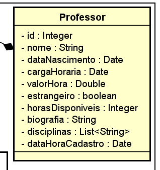

# MJV-PROJETO-JDBC-GRUPO3

## Objetivo: 
O objetivo deste projeto é desenvolver um sistema de gerenciamento de professores, utilizando JDBC e Java. O sistema deverá permitir a realização das principais operações de um CRUD (Create, Read, Update, Delete) para a entidade Professor. O projeto visa implementar as funcionalidades de adicionar novos professores, atualizar os dados existentes, listar todos os registros e excluir um professor específico.

O uso do JDBC garantirá a conexão com um banco de dados, proporcionando uma integração eficiente para armazenar e recuperar os dados dos professores. 

O objetivo final é criar um sistema completo e funcional que permita a gestão dos dados, facilitando a organização e manipulação das informações.

## Diagrama da classe Professor utilizada para o projeto:

## Técnologias utilizadas:

✅ Java Development Kit (JDK) 19 ou superior

✅ PostgreSQL 

✅ Maven

